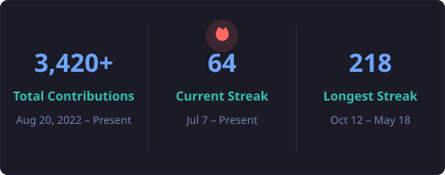

<div align="center">

# 👋 Hi there, I'm Cahflitto!
### 🏛️ Enterprise Solutions Architect & Principal Full-Stack Engineer

[](https://github.com/cahflitto)
[](https://github.com/cahflitto)
[](https://github.com/cahflitto)

<p align="center">
  Engineering robust, mission-critical systems, distributed microservices, and end-to-end enterprise architectures.<br>
  Specialized in high-concurrency platforms, cloud-native infrastructure, DevOps automation, and scalable database ecosystems.
</p>

<!-- Interactive Contribution Snake -->
<p align="center">
  
</p>

</div>

---

## 📊 Analytics & GitHub Telemetry

<div align="center">
  <p>
    
  </p>
  <p>
    
    
  </p>
</div>

---

## 🏆 Enterprise Certifications & Credentials

<div align="center">

| Domain | Verified Enterprise Certifications & Standards |
| :--- | :--- |
| **Cloud Architecture** | [](https://aws.amazon.com/certification/) [](https://cloud.google.com/certification) [](https://learn.microsoft.com/) |
| **DevOps & Containers** | [-326CE5?style=for-the-badge&logo=kubernetes&logoColor=white)](https://www.cncf.io/) [-EE0000?style=for-the-badge&logo=redhat&logoColor=white)](https://www.redhat.com/) [](https://www.docker.com/) [](https://www.hashicorp.com/) |
| **Software & Engineering** | [](https://laravel.com/) [](https://www.oracle.com/) [](https://www.meta.com/) |
| **Security & Networking** | [](https://www.isc2.org/) [-19495C?style=for-the-badge&logo=mikrotik&logoColor=white)](https://mikrotik.com/) [](https://www.iso.org/) |
| **Methodology** | [-009688?style=for-the-badge&logo=scrumalliance&logoColor=white)](https://www.scrum.org/) [](https://www.axelos.com/) |

</div>

---

## 🛠️ Complete Enterprise Tech Stack & Competencies

### 🏛️ Architecture & System Design
```
Microservices Architecture • Event-Driven Architecture (EDA) • Domain-Driven Design (DDD)
High Availability (HA) & Fault Tolerance • Distributed Caching & Message Queuing
Load Balancing & Reverse Proxies • Zero-Trust Security Models • Multi-Tenant Systems
```

### 💻 Languages & Frameworks

| Layer | Enterprise Technologies & Frameworks |
| :--- | :--- |
| **Backend & Core** | [](https://www.php.net/) [](https://laravel.com/) [](https://nodejs.org/) [](https://nestjs.com/) [](https://go.dev/) [](https://www.python.org/) [](https://fastapi.tiangolo.com/) [](https://spring.io/) [](https://www.rust-lang.org/) [](https://dotnet.microsoft.com/) |
| **Frontend & UI/UX** | [](https://www.typescriptlang.org/) [](https://developer.mozilla.org/) [](https://vuejs.org/) [](https://nuxt.com/) [](https://react.dev/) [](https://nextjs.org/) [](https://tailwindcss.com/) [](https://getbootstrap.com/) |
| **Mobile Development** | [](https://flutter.dev/) [](https://dart.dev/) [](https://reactnative.dev/) [](https://developer.android.com/) |
| **Database & Cache** | [](https://www.postgresql.org/) [](https://www.mysql.com/) [](https://www.microsoft.com/sql-server) [](https://redis.io/) [](https://www.mongodb.com/) [](https://kafka.apache.org/) [](https://www.elastic.co/) |
| **DevOps & Cloud** | [](https://kubernetes.io/) [](https://www.docker.com/) [](https://www.jenkins.io/) [](https://github.com/features/actions) [](https://nginx.org/) [](https://aws.amazon.com/) [](https://cloud.google.com/) [](https://www.cloudflare.com/) |
| **Networking & Systems** | [](https://www.kernel.org/) [](https://www.gnu.org/software/bash/) [](https://mikrotik.com/) [](https://www.wireguard.com/) [](https://genieacs.com/) |
| **Testing & Observability** | [](https://phpunit.de/) [](https://jestjs.io/) [](https://www.cypress.io/) [](https://prometheus.io/) [](https://grafana.com/) [](https://www.postman.com/) |

---

<div align="center">
  <h3>🤝 Let's Connect & Build Something Powerful</h3>
  <p>
    Open for enterprise architecture consulting, high-impact collaborations, and mission-critical engineering.
  </p>
  <sub>⚡ Powered by High-Availability Infrastructure & Continuous Integration</sub>
</div>
<!-- Profile verified & optimized -->
